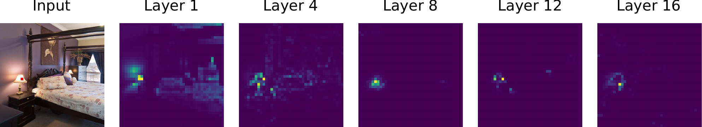
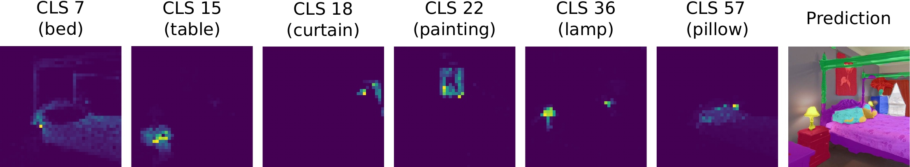

# Segmenter: Transformer for Semantic Segmentation


[Segmenter: Transformer for Semantic Segmentation](https://arxiv.org/abs/2105.05633)
by Robin Strudel*, Ricardo Garcia*, Ivan Laptev and Cordelia Schmid, ICCV 2021.

*Equal Contribution
## Installation

Define os environment variables pointing to your checkpoint and dataset directory, put in your `.bashrc`:
```sh
export DATASET=/path/to/dataset/dir
```

Install [PyTorch 1.9](https://pytorch.org/) then `pip install .` at the root of this repository.

To download ADE20K, use the following command:
```python
python -m segm.scripts.prepare_ade20k $DATASET
```

## Model Zoo
We release models with a Vision Transformer backbone initialized from the [improved ViT](https://arxiv.org/abs/2106.10270) models.

### ADE20K

Segmenter models with ViT backbone:
<table>
  <tr>
    <th>Name</th>
    <th>mIoU (SS/MS)</th>
    <th># params</th>
    <th>Resolution</th>
    <th>FPS</th>
    <th colspan="3">Download</th>
  </tr>
<tr>
    <td>Seg-T-Mask/16</td>
    <td>38.1 / 38.8</td>
    <td>7M</td>
    <td>512x512</td>
    <td>52.4</td>
    <td><a href="https://www.rocq.inria.fr/cluster-willow/rstrudel/segmenter/checkpoints/ade20k/seg_tiny_mask/checkpoint.pth">model</a></td>
    <td><a href="https://www.rocq.inria.fr/cluster-willow/rstrudel/segmenter/checkpoints/ade20k/seg_tiny_mask/variant.yml">config</a></td>
    <td><a href="https://www.rocq.inria.fr/cluster-willow/rstrudel/segmenter/checkpoints/ade20k/seg_tiny_mask/log.txt">log</a></td>
  </tr>
<tr>
    <td>Seg-S-Mask/16</td>
    <td>45.3 / 46.9</td>
    <td>27M</td>
    <td>512x512</td>
    <td>34.8</td>
    <td><a href="https://www.rocq.inria.fr/cluster-willow/rstrudel/segmenter/checkpoints/ade20k/seg_small_mask/checkpoint.pth">model</a></td>
    <td><a href="https://www.rocq.inria.fr/cluster-willow/rstrudel/segmenter/checkpoints/ade20k/seg_small_mask/variant.yml">config</a></td>
    <td><a href="https://www.rocq.inria.fr/cluster-willow/rstrudel/segmenter/checkpoints/ade20k/seg_small_mask/log.txt">log</a></td>
  </tr>
<tr>
    <td>Seg-B-Mask/16</td>
    <td>48.5 / 50.0</td>
    <td>106M</td>
    <td>512x512</td>
    <td>24.1</td>
    <td><a href="https://www.rocq.inria.fr/cluster-willow/rstrudel/segmenter/checkpoints/ade20k/seg_base_mask/checkpoint.pth">model</a></td>
    <td><a href="https://www.rocq.inria.fr/cluster-willow/rstrudel/segmenter/checkpoints/ade20k/seg_base_mask/variant.yml">config</a></td>
    <td><a href="https://www.rocq.inria.fr/cluster-willow/rstrudel/segmenter/checkpoints/ade20k/seg_base_mask/log.txt">log</a></td>
  </tr>
<tr>
    <td>Seg-B/8</td>
    <td>49.5 / 50.5</td>
    <td>89M</td>
    <td>512x512</td>
    <td>4.2</td>
    <td><a href="https://www.rocq.inria.fr/cluster-willow/rstrudel/segmenter/checkpoints/ade20k/seg_base_patch8/checkpoint.pth">model</a></td>
    <td><a href="https://www.rocq.inria.fr/cluster-willow/rstrudel/segmenter/checkpoints/ade20k/seg_base_patch8/variant.yml">config</a></td>
    <td><a href="https://www.rocq.inria.fr/cluster-willow/rstrudel/segmenter/checkpoints/ade20k/seg_base_patch8/log.txt">log</a></td>
  </tr>
<tr>
    <td>Seg-L-Mask/16</td>
    <td>51.8 / 53.6</td>
    <td>334M</td>
    <td>640x640</td>
    <td>-</td>
    <td><a href="https://www.rocq.inria.fr/cluster-willow/rstrudel/segmenter/checkpoints/ade20k/seg_large_mask_640/checkpoint.pth">model</a></td>
    <td><a href="https://www.rocq.inria.fr/cluster-willow/rstrudel/segmenter/checkpoints/ade20k/seg_large_mask_640/variant.yml">config</a></td>
    <td><a href="https://www.rocq.inria.fr/cluster-willow/rstrudel/segmenter/checkpoints/ade20k/seg_large_mask_640/log.txt">log</a></td>
  </tr>
</table>

Segmenter models with DeiT backbone:
<table>
  <tr>
    <th>Name</th>
    <th>mIoU (SS/MS)</th>
    <th># params</th>
    <th>Resolution</th>
    <th>FPS</th>
    <th colspan="3">Download</th>
  </tr>
<tr>
    <td>Seg-B<span>&#8224;</span>/16</td>
    <td>47.1 / 48.1</td>
    <td>87M</td>
    <td>512x512</td>
    <td>27.3</td>
    <td><a href="https://www.rocq.inria.fr/cluster-willow/rstrudel/segmenter/checkpoints/ade20k/seg_base_deit_linear/checkpoint.pth">model</a></td>
    <td><a href="https://www.rocq.inria.fr/cluster-willow/rstrudel/segmenter/checkpoints/ade20k/seg_base_deit_linear/variant.yml">config</a></td>
    <td><a href="https://www.rocq.inria.fr/cluster-willow/rstrudel/segmenter/checkpoints/ade20k/seg_base_deit_linear/log.txt">log</a></td>
  </tr>
<tr>
    <td>Seg-B<span>&#8224;</span>-Mask/16</td>
    <td>48.7 / 50.1</td>
    <td>106M</td>
    <td>512x512</td>
    <td>24.1</td>
    <td><a href="https://www.rocq.inria.fr/cluster-willow/rstrudel/segmenter/checkpoints/ade20k/seg_base_deit_mask/checkpoint.pth">model</a></td>
    <td><a href="https://www.rocq.inria.fr/cluster-willow/rstrudel/segmenter/checkpoints/ade20k/seg_base_deit_mask/variant.yml">config</a></td>
    <td><a href="https://www.rocq.inria.fr/cluster-willow/rstrudel/segmenter/checkpoints/ade20k/seg_base_deit_mask/log.txt">log</a></td>

  </tr>
</table>

### Pascal Context
<table>
  <tr>
    <th>Name</th>
    <th>mIoU (SS/MS)</th>
    <th># params</th>
    <th>Resolution</th>
    <th>FPS</th>
    <th colspan="3">Download</th>
  </tr>
<tr>
    <td>Seg-L-Mask/16</td>
    <td>58.1 / 59.0</td>
    <td>334M</td>
    <td>480x480</td>
    <td>-</td>
    <td><a href="https://www.rocq.inria.fr/cluster-willow/rstrudel/segmenter/checkpoints/pascal_context/seg_large_mask/checkpoint.pth">model</a></td>
    <td><a href="https://www.rocq.inria.fr/cluster-willow/rstrudel/segmenter/checkpoints/pascal_context/seg_large_mask/variant.yml">config</a></td>
    <td><a href="https://www.rocq.inria.fr/cluster-willow/rstrudel/segmenter/checkpoints/pascal_context/seg_large_mask/log.txt">log</a></td>
  </tr>
</table>

### Cityscapes
<table>
  <tr>
    <th>Name</th>
    <th>mIoU (SS/MS)</th>
    <th># params</th>
    <th>Resolution</th>
    <th>FPS</th>
    <th colspan="3">Download</th>
  </tr>
<tr>
    <td>Seg-L-Mask/16</td>
    <td>79.1 / 81.3</td>
    <td>322M</td>
    <td>768x768</td>
    <td>-</td>
    <td><a href="https://www.rocq.inria.fr/cluster-willow/rstrudel/segmenter/checkpoints/cityscapes/seg_large_mask/checkpoint.pth">model</a></td>
    <td><a href="https://www.rocq.inria.fr/cluster-willow/rstrudel/segmenter/checkpoints/cityscapes/seg_large_mask/variant.yml">config</a></td>
    <td><a href="https://www.rocq.inria.fr/cluster-willow/rstrudel/segmenter/checkpoints/cityscapes/seg_large_mask/log.txt">log</a></td>
  </tr>
</table>

## Inference

Download one checkpoint with its configuration in a common folder, for example `seg_tiny_mask`.

You can generate segmentation maps from your own data with:
```python
python -m segm.inference --model-path seg_tiny_mask/checkpoint.pth -i images/ -o segmaps/ 
```

To evaluate on ADE20K, run the command:
```python
# single-scale evaluation:
python -m segm.eval.miou seg_tiny_mask/checkpoint.pth ade20k --singlescale
# multi-scale evaluation:
python -m segm.eval.miou seg_tiny_mask/checkpoint.pth ade20k --multiscale
```

## Train

Train `Seg-T-Mask/16` on ADE20K on a single GPU:
```python
python -m segm.train --log-dir seg_tiny_mask --dataset ade20k \
  --backbone vit_tiny_patch16_384 --decoder mask_transformer
```

To train `Seg-B-Mask/16`, simply set `vit_base_patch16_384` as backbone and launch the above command using a minimum of 4 V100 GPUs (~12 minutes per epoch) and up to 8 V100 GPUs (~7 minutes per epoch). The code uses [SLURM](https://slurm.schedmd.com/documentation.html) environment variables.

## Logs

To plot the logs of your experiments, you can use
```python
python -m segm.utils.logs logs.yml
```

with `logs.yml` located in `utils/` with the path to your experiments logs:
```yaml
root: /path/to/checkpoints/
logs:
  seg-t: seg_tiny_mask/log.txt
  seg-b: seg_base_mask/log.txt
```

## Attention Maps

To visualize the attention maps for `Seg-T-Mask/16` encoder layer 0 and patch `(0, 21)`, you can use:

```python
python -m segm.scripts.show_attn_map seg_tiny_mask/checkpoint.pth \ 
images/im0.jpg output_dir/ --layer-id 0 --x-patch 0 --y-patch 21 --enc
```

Different options are provided to select the generated attention maps:
* `--enc` or `--dec`: Select encoder or decoder attention maps respectively.
* `--patch` or `--cls`: `--patch` generates attention maps for the patch with coordinates `(x_patch, y_patch)`. `--cls` combined with `--enc` generates attention maps for the CLS token of the encoder. `--cls` combined with `--dec` generates maps for each class embedding of the decoder.
* `--x-patch` and `--y-patch`: Coordinates of the patch to draw attention maps from. This flag is ignored when `--cls` is used.
* `--layer-id`: Select the layer for which the attention maps are generated.

For example, to generate attention maps for the decoder class embeddings, you can use:

```python
python -m segm.scripts.show_attn_map seg_tiny_mask/checkpoint.pth \
images/im0.jpg output_dir/ --layer-id 0 --dec --cls
```

Attention maps for patch `(0, 21)` in `Seg-L-Mask/16` encoder layers 1, 4, 8, 12 and 16: 



Attention maps for the class embeddings in `Seg-L-Mask/16` decoder layer 0: 



## Video Segmentation

Zero shot video segmentation on [DAVIS](https://davischallenge.org/) video dataset with Seg-B-Mask/16 model trained on [ADE20K](https://groups.csail.mit.edu/vision/datasets/ADE20K/).

<p align="middle">
  
  
</p>
<p align="middle">
  
  
</p>

## BibTex

```
@article{strudel2021,
  title={Segmenter: Transformer for Semantic Segmentation},
  author={Strudel, Robin and Garcia, Ricardo and Laptev, Ivan and Schmid, Cordelia},
  journal={arXiv preprint arXiv:2105.05633},
  year={2021}
}
```


## Acknowledgements

The Vision Transformer code is based on [timm](https://github.com/rwightman/pytorch-image-models) library and the semantic segmentation training and evaluation pipeline 
is using [mmsegmentation](https://github.com/open-mmlab/mmsegmentation).
