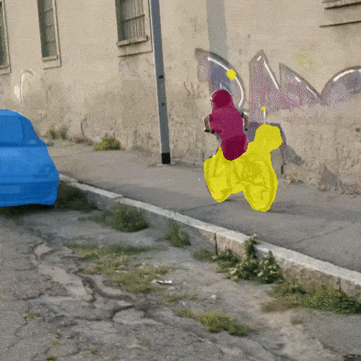

# Segmenter - Transformer for Semantic Segmentation


[Segmenter: Transformer for Semantic Segmentation](https://arxiv.org/abs/)
by Robin Strudel, Ricardo Garcia, Ivan Laptev and Cordelia Schmid. 

## Installation

The code and several trained models will be released soon.

## Video Segmentation




## BibTex

```
@article{strudel2021,
  title={Segmenter: Transformer for Semantic Segmentation},
  author={Strudel, Robin and Garcia, Ricardo and Laptev, Ivan and Schmid, Cordelia},
  journal={arXiv preprint arXiv:?},
  year={2021}
}
```


## Credits

The Vision Transformer code is based on [timm](https://github.com/rwightman/pytorch-image-models) library and the semantic segmentation training and evaluation pipeline 
is using [mmsegmentation](https://github.com/open-mmlab/mmsegmentation).
